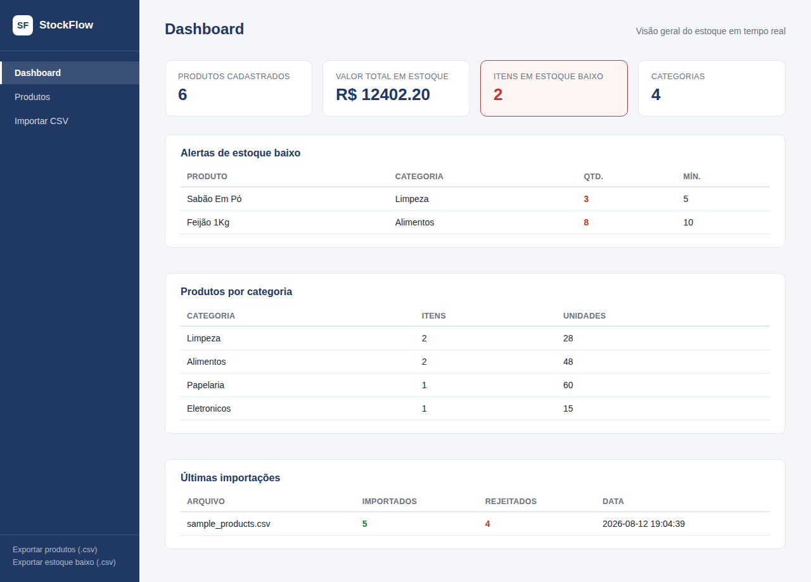

# StockFlow — Sistema de Controle de Estoque com Automação de Dados

Aplicação web para gestão de estoque com foco em **automação, validação e limpeza de dados**.
Além do CRUD tradicional de produtos, o sistema permite importar planilhas CSV inteiras de uma
vez, validando e higienizando cada linha automaticamente antes de gravar no banco.



## Funcionalidades

- **CRUD completo de produtos** — cadastro, edição, exclusão e busca com filtro por categoria.
- **Importação em massa via CSV** — sobe uma planilha e o sistema valida cada linha:
  - rejeita nomes vazios, quantidades/preços negativos ou não numéricos;
  - remove duplicados dentro do próprio arquivo;
  - normaliza capitalização e espaços em branco;
  - gera um relatório detalhado das linhas aceitas e rejeitadas (com o motivo de cada rejeição).
- **Exportação de dados** — exporta o estoque completo ou apenas os itens em estoque baixo em CSV.
- **Dashboard em tempo real** — total de produtos, valor total em estoque, alertas de estoque
  baixo e distribuição por categoria.
- **Script de automação standalone** (`scripts/generate_report.py`) — gera um relatório `.txt`
  do estoque via linha de comando, sem precisar subir o servidor web (útil para agendar via
  cron ou Task Scheduler).
- **Histórico de importações** — cada importação fica registrada com contagem de linhas
  aceitas/rejeitadas para auditoria.

## Tecnologias

| Camada          | Tecnologia                                  |
|-----------------|----------------------------------------------|
| Backend         | Python 3, Flask                              |
| Automação/Dados | pandas (validação, limpeza e transformação)  |
| Banco de dados  | SQLite                                       |
| Frontend        | HTML + CSS puro (Jinja2 templates)           |

## Como rodar localmente

```bash
# 1. Clone o repositório
git clone https://github.com/joaovictorferreira/stockflow.git
cd stockflow

# 2. Crie e ative um ambiente virtual
python3 -m venv venv
source venv/bin/activate      # Windows: venv\Scripts\activate

# 3. Instale as dependências
pip install -r requirements.txt

# 4. Rode a aplicação
python app.py
```

Acesse **http://127.0.0.1:5000** no navegador. O banco SQLite é criado automaticamente na
primeira execução (`data/stockflow.db`).

Um arquivo de exemplo para testar a importação está em `static/sample_products.csv` — ele
propositalmente contém linhas com erros (nome vazio, quantidade negativa, item duplicado,
valor não numérico) para demonstrar a validação em ação.

### Rodar o script de relatório standalone

```bash
python scripts/generate_report.py
```

## Estrutura do projeto

```
stockflow/
├── app.py                  # Rotas Flask
├── database.py             # Acesso ao banco (SQLite)
├── data_automation.py      # Validação, limpeza, importação/exportação CSV
├── requirements.txt
├── scripts/
│   └── generate_report.py  # Automação standalone (fora do Flask)
├── static/
│   ├── css/style.css
│   └── sample_products.csv
├── templates/
│   ├── base.html
│   ├── dashboard.html
│   ├── products.html
│   ├── product_form.html
│   └── import.html
└── data/                   # Banco SQLite (gerado em runtime)
```

## Decisões de projeto

- **SQLite** em vez de um SGBD externo para manter o projeto autocontido e fácil de rodar por
  qualquer avaliador, sem precisar subir infraestrutura extra.
- **Validação linha a linha na importação** (em vez de rejeitar o arquivo inteiro ao primeiro
  erro) porque em cenários reais de estoque a planilha normalmente vem de fontes diferentes e
  nem sempre está 100% limpa — o sistema aproveita o que é válido e reporta o resto.
- **Sem framework JS no frontend** — o projeto usa Flask + Jinja2 puro propositalmente, para
  manter o foco em backend, dados e automação, que é o objetivo central do projeto.

## Possíveis evoluções

- Autenticação de usuários e controle de permissões.
- Histórico de movimentações de estoque (entradas/saídas), não só saldo atual.
- Paginação na listagem de produtos para bases grandes.
- Testes automatizados com `pytest`.

---

Projeto desenvolvido por **João Victor Ferreira** como parte do portfólio pessoal.
[LinkedIn](https://www.linkedin.com/in/jo%C3%A3o-victor-ferreira-b154a326a/) · [GitHub](https://github.com/JoaoVictorFerreira27)
